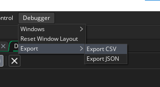
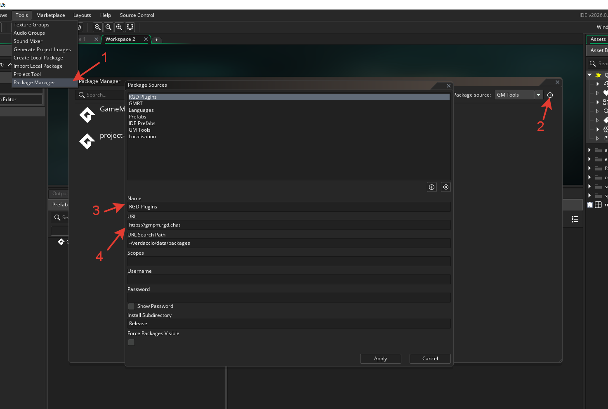

# DebuggerDump

GameMaker IDE plugin for exporting profiling data collected by the Debugger.

## Formats

- **CSV** — flat table: `Name`, `CallCount`, `TimeMilliseconds`, `StepPercent`, `Level`
- **JSON** — tree structure with snake_case fields: `name`, `call_count`, `time_milliseconds`, `step_percent`, `children`

## Usage

1. Start a debug session in GameMaker.
2. Open the **Debugger** menu → **Export** → **Export CSV** or **Export JSON**.
3. Choose a file path and save.

## Installation

1. Open the Package Manager found in **Tools → Package Manager**.
2. Add the RGD registry: name `RGD Plugins`, URL `https://gmpm.rgd.chat/`.
3. Install **DebuggerDump** and enable it.
4. Restart GameMaker.

